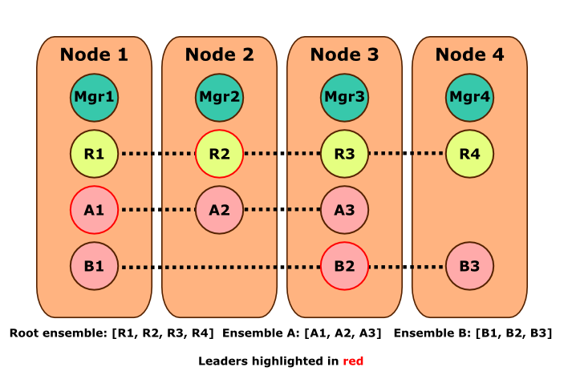
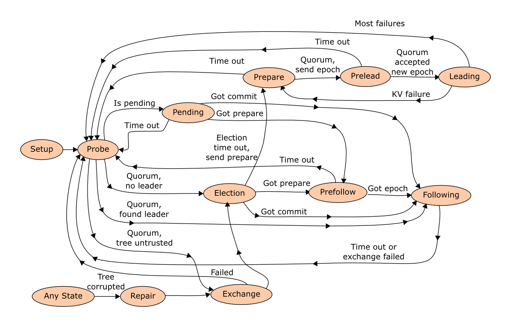
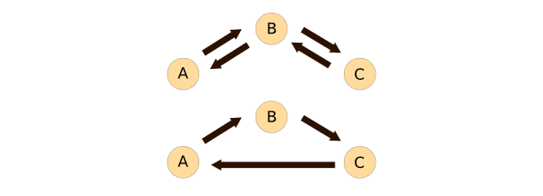

* [Overview](#overview)
* [Process hierarchy](#process-hierarchy)
* [Cluster membership](#cluster-membership)
  * [Cluster activation](#cluster-activation)
  * [Adding a node](#adding-a-node)
  * [Removing a node](#removing-a-node)
  * [Creating an ensemble](#creating-an-ensemble)
  * [Modifying ensembles](#modifying-ensembles)
* [KV operations](#kv-operations)
  * [Get path](#get-path)
  * [Put path](#put-path)
  * [Overwrite path](#overwrite-path)
* [Facts](#facts)
* [Manager](#manager)
* [Root ensemble](#root-ensemble)
* [Peer states](#peer-states)
* [Leader leases](#leader-leases)
* [Message routing](#message-routing)
* [Peer trees](#peer-trees)
* [Storage](#storage)
* [Module reference](#module-reference)


------------------------------------------------------------
# Overview

This library manages consensus groups (ensembles) in a cluster, where each ensemble can execute [linearizable][linearizability] [key/value (K/V) operations](#kv-operations) over a key set. Ensemble members (peers) can be added and removed dynamically. Although created to implement strongly consistent K/V operations in Riak, its [pluggable backends](#riak_ensemble_backend) allow it to be used with other K/V storage engines.

Requests sent to an ensemble are processed by its leader and replicated to a quorum of followers. To ensure consistency in the presence of failures, it uses an algorithm based on [paxos][] in its [vertical flavor][vertical paxos] with many similarities to [raft][]. Consistency is achieved by sacrificing availability. Requests will fail if there is no leader with a quorum of following peers. Leadership changes are safe but degrade the performance of the system, so riak_ensemble is designed to avoid them as much as possible. For this, peers enter a [probe state](#probe-state) before triggering elections. [leader leases](#leader-leases), similar to master leases in the [paxos made live][] paper, allow a leader to serve read requests without consulting a quorum in some cases.

Besides the K/V data managed by its backend, each peer also stores a small amount of metadata used in the consensus algorithm and during [membership changes](#modifying-ensembles) in its [fact record](#facts). Fact storage is centralized in the [storage](#storage) process for efficiency. To prevent undetected data corruption from compromising the safety of the consensus algorithm, it also stores object metadata in its [peer tree](#peer-trees): a type of [merkle tree][] for fast data integrity that is exchanged and verified between peers.

The list of nodes and ensembles in the cluster is managed by a special ensemble called the [root ensemble](#root-ensemble). Cluster state including the ensemble peer lists, leaders, etc, is managed by the [manager process](#manager) on each node and gossiped around the cluster.

* [Original Paxos paper][paxos]
* [Vertical Paxos][vertical paxos]
* [Raft consensus algorithm][raft]
* [Paxos made live][paxos made live]
* [Merkle tree][merkle tree]

[linearizability]: http://en.wikipedia.org/wiki/Linearizability
[paxos]: http://research.microsoft.com/en-us/um/people/lamport/pubs/lamport-paxos.pdf
[vertical paxos]: http://research.microsoft.com/en-us/um/people/lamport/pubs/vertical-paxos.pdf
[raft]: https://ramcloud.stanford.edu/wiki/download/attachments/11370504/raft.pdf
[paxos made live]: http://research.google.com/archive/paxos_made_live.pdf
[merkle tree]: http://en.wikipedia.org/wiki/Merkle_tree 

------------------------------------------------------------
# Process hierarchy

Under the top supervisor we have a number of routers, the manager, the storage worker and a variable number of peer processes under the peer supervisor. Each peer is linked to a lease worker and a peer tree process, and it monitors a fixed number of worker processes which are restarted if needed.


The children of riak_ensemble_sup are part of a "rest for one" hierarchy and started in the order above (2). When a child dies, that child and the children started after it are all restarted in the order listed. So the death of riak_ensemble_storage, for example, would take down the manager and the peer supervisor, then restart them in the original order: storage first, then the peer supervisor and lastly the manager.

Each peer is linked to a process handling leader leases and a process handling its peer tree.  It also monitors a fixed pool of workers that handle operations to avoid blocking the peer.  Routing is handled by a pool of routing servers for concurrency.

Visualizing the main processes in an ensemble cluster:


1. [riak_ensemble_sup](../src/riak_ensemble_sup.erl)
3. [Erlang supervisor](http://www.erlang.org/doc/man/supervisor.html)

------------------------------------------------------------
# Cluster membership

Before nodes can form an ensemble cluster, every node should be running the riak_ensemble app. A cluster needs to be activated exactly once in only one node. This creates the special root ensemble that manages the cluster nodes and ensembles lists.

## Cluster activation

A cluster is activated by calling the manager's enable function (1), which makes the local manager set the enabled flag and add the root ensemble with a single peer running on the local node to its cluster state record (2) (3). When the manager checks its state for changes, it will notice the new root peer and start it (4).

1. [riak_ensemble_manager:enable/0][]
2. The `enable` clause of [riak_ensemble_manager:handle_call/3][]
3. [riak_ensemble_manager:activate/1][]
4. [riak_ensemble_manager:state_changed/1][]

## Adding a node

Nodes are added to the cluster by calling the manager's join function, which sends the join request to the manager of the node to be added (1).  That manager will request the cluster state from the other node it is trying to join (2) and forward the join request to the root ensemble (3). If the root ensemble succesfully commits the change, its leader will eventually gossip this new cluster state to the managers (4). The join will fail if the cluster is not enabled on the other node, of if both sides have been enabled but have different cluster ids (5).

1. [riak_ensemble_manager:join/2][]
2. join clause of [riak_ensemble_manager:handle_call/3][]
3. [Root ensemble](#root-ensemble)
4. call to [riak_ensemble_root:gossip/4][] in [riak_ensemble_peer:maybe_update_ensembles/1][]
5. [riak_ensemble_manager:join_allowed/2][]. 


## Removing a node

Nodes are removed by calling the manager's remove function (1). The request is forwarded to the root ensemble, whose leader will remove the node from its cluster state object and will gossip it to the remaining managers on its next periodic tick if succesful (3). Notice that that there is no mechanism to alert the manager of the removed node about its removal from the cluster, or that peers belonging to the removed node should be also removed. 

1. [riak_ensemble_manager:remove/2][].
2. `{remove, Node}` clause of [riak_ensemble_manager:handle_call/3][]
3. [Root ensemble](#root-ensemble)

## Creating an ensemble

Ensembles are created by calling the manager's create_ensemble function (1), which simply forwards to the root ensemble to update the ensemble list in its cluster state object (2). The root ensemble will gossip the new cluster state to the managers. On each node with new or deleted peers, the manager will start or stop them when it periodically checks for changes (3).

1. [riak_ensemble_manager:create_ensemble/5][]
2. [root ensemble](#root-ensemble)
3. [riak_ensemble_manager:state_changed/1][]

## Modifying ensembles

Transitioning an ensemble from a set of member peers (a view) to another is a complex multi-step process involving the ensemble leader and the managers. First, 
the peer update_members function is called (1) with the desired member additions and deletions. The leader will apply these changes to the most recent view in its fact and store both the old and new view in the pending field and commit this updated fact to a quorum of peers from the current view (2).
On its periodic tick (3), the leader will send the pending views list to the local manager (4), which will periodically gossip it to other managers (5). The newly added or removed peers will eventually be started or stopped when managers on each node periodically check their ensemble data and notice the changes (6). 
On a subsequent tick, the leader will ask the local manager for the latest pending views it has seen for its ensemble. It will then move them to the views field of its fact and commit it to a quorum (7). After this point, operations will require a quorum involving the new and old members of the ensemble. Since there is no guarantee that the new peers have started, the leader may have to step down if it fails to have a quorum. On a subsequent tick, the leader will notice that the views in the pevious step were succesfully committed, and will remove all but the most recent view from the fact, then commit it (8). On a later tick, the leader will notice its pending views have been commited, clear the pending field in its fact and commit it (9). We are good to go!

Most of the above steps happen in the leader_tick function (3), with state stored in a number of fact fields. Notice that during this process multiple views might be stored in the fact's views list up until the final transition, with the most recent at the head of the list. The function is structured so that these actions are tried and as soon as one of them triggers and commits a fact to a quorum, the rest is skipped. The following pseudo code hopefully helps:

```
update_members:
    fact.pending.vsn = fact.vsn
    fact.pending.views = [NewView | fact.views]
    commit fact

maybe_update_ensembles:
    fact.pending -> manager

change views:
    mgr_pending : pending views according to manager
    if mgr_pending.vsn > fact.pend_vsn
        fact.views    = mgr_pending.views
        fact.view_vsn = fact.vsn
        fact.pend_vsn = mgr_pending.vsn
        commit fact

transition:
    if multiple views and current views committed a fact
        fact.views      = head(fact.views)
        fact.view_vsn   = fact.vsn
        fact.commit_vsn = fact.pend_vsn
        commit fact

clear pending:
    if pending committed
      fact.pending = {fact.vsn, []}
      commit fact
```

1. [riak_ensemble_peer:update_members/3][]
2. The `{update_members, Changes}` clause of [riak_ensemble_peer:leading/3][].
3. [riak_ensemble_peer:leader_tick/1][]
4. [riak_ensemble_peer:maybe_update_ensembles/1][]
5. [riak_ensemble_manager:tick/1][]
6. [riak_ensemble_manager:state_changed/1][]
7. [riak_ensemble_peer:maybe_change_views/1][]
8. [riak_ensemble_peer:maybe_transition/1][]
9. [riak_ensemble_peer:maybe_clear_pending/1][]

------------------------------------------------------------
# KV operations

K/V operations are handled by ensemble leaders, which normally coordinates with a quorum of followers to process them.  The consensus algorithm ensures that these operations are atomic and operate on the latest version of an object. Objects are written with a two part version number: The epoch, which changes only with a leader change, and the sequence number which is incremented on each write operation.

* **kget(Key)** : Get value for key
* **kupdate(Key, OldValue, NewValue)** : A compare-and-swap atomic update.  Replace with NewValue if value is still OldValue.
* **kput_once(Key, NewValue)** : Put only if there is no current value
* **kover(Key, NewValue)** : Blindly overwrite the current value with the new one.
* **kmodify(Key, ModFun, DefaultValue)** : Update by applying a function to the current value, using DefaultValue if absent.  **kmodify** is not exposed in riak_ensemble_client and is only used by the root ensemble. 
* **kdelete(Key)** : Plain delete. Implemented as call to **kover** with the `notfound` atom as value.
* **ksafe_delete(Key, OldValue)** : Conditional delete. Implemented as a call to **kupdate** operation with the `notfound` atom as value.

The [riak_ensemble_client](#riak_ensemble_client) module contains the Key/Value operation interface. It mostly forwards calls to their equivalent in [riak_ensemble_peer](#riak_ensemble_peer) after checking if the ensemble system is locally enabled and then reformats the returned values (1) (2).
The K/V peer functions forward the request to the ensemble leader using routers (3).  The leader executes these client K/V requests in one of the workers from its fixed length pool based on the hash of the key to avoid concurrently modifying an object from different processes (4) (5).
If a follower receives a K/V operation, it forwards it to its leader (6).  If a client K/V operation is received by a peer in any other state, it is simply ignored. **Note**: the clauses that send nack messages to unhandled get and put messages are for internal leader to follower gets and puts (7) (8).


1. [riak_ensemble_client:maybe/2][]
2. [riak_ensemble_client:translate/1][]
3. [routers](#message-routing)
4. [riak_ensemble_peer:leading_kv/3][]
5. [riak_ensemble_peer:async/3][]
6. [riak_ensemble_peer:following_kv/3][]
7. Last, fallback clause in [riak_ensemble_peer:common/3][]
8. [riak_ensemble_peer:nack/2][]
10. [riak_ensemble_peer:do_kupdate/4][]
11. [riak_ensemble_peer:do_kput_once/4][]
12. [riak_ensemble_peer:do_kmodify/4][]

## Get path

In response to a `{get, Key, Opts}` message, the leader executes the get FSM function in a worker (1). The worker first looks up the key in the local peer tree. The request will fail if tree corruption is detected. Otherwise the worker requests the local value by sending a `{local_get, Key}` message back to the leader process (2).

If the local value passes the integrity test and was written in the current epoch (3), it may be returned without consulting followers if the lease is still up and configured to trust leases (4). If the read_repair option is passed, however, the worker will always fetch the value from a quorum of followers, requiring that at least one of the replies matches our local tree (either the same version or it is missing in both trees) (5). It will then issue conditional puts to update all peers (including itself) with the latest value (6). **Note**: There is a TODO item to update only divergent peers.

If the local value has an earlier epoch, then the latest value is fetched from a quorum of peers and it is rewritten to a quorum with an updated epoch and sequence number (7). This is necessary to avoid inconsistencies from partial write failures. This is an important fact: Leadership changes will affect the performance of reads by adding this obligatory read + write rounds.

The peer tree is updated with this object's latest version after the quorum write (8) (9).

1. [riak_ensemble_peer:do_get_fsm/5][]
2. [riak_ensemble_peer:local_get/3][]
3. [riak_ensemble_peer:is_current/4][]
4. [riak_ensemble_peer:check_lease/1][]
5. [riak_ensemble_peer:get_latest_obj/4][]
6. [riak_ensemble_peer:maybe_repair/4][]
7. [riak_ensemble_peer:update_key/4][]
8. [riak_ensemble_peer:put_obj/4][]
9. [riak_ensemble_peer:update_hash/3][]

## Put path

kupdate, kput_once and kmodify operations all use the same put code path passing a different callback function and arguments (1) (2) (3). The overwrite operations use a different code path.

A `{put, Key, CallbackFun, Args}` message is sent to the ensemble leader, which executes the put FSM function in a worker. The worker first looks up the key in the peer tree, bailing if corruption is detected (4). It then requests the local value by sending a `{local_get, Key}` message back to the leader process (5). If the local value passes the integrity test and was written in the current epoch (6), it is considered the latest version.
Then the callback can be applied to the local value and written to a quorum of peers (7).
If the data integrity test fails or the object was written in a previous epoch, first we read it from a quorum of peers and rewrite it with a new epoch to a quorum of peers. This fresh value can now be updated and written to a quorum like in the previous case (8) (7).

1. [riak_ensemble_peer:do_kupdate/4][]
2. [riak_ensemble_peer:do_kput_once/4][]
3. [riak_ensemble_peer:do_kmodify/4][]
4. [riak_ensemble_peer:do_put_fsm/6][]
5. [riak_ensemble_peer:local_get/3][]
6. [riak_ensemble_peer:is_current/4][]
7. [riak_ensemble_peer:do_modify_fsm/6][]
8. [riak_ensemble_peer:update_key/4][]

## Overwrite path

This path is very simple because it does not matter what the latest version of a value is. On receiving an `{overwrite, Key, Value}` message, the leader executes the overwrite FSM function in a worker (1).  A new value with the current epoch and next sequence number is then written to a quorum of peers (2).

1. [riak_ensemble_peer:do_overwrite_fsm/5][]
2. [riak_ensemble_peer:put_obj/3][]

------------------------------------------------------------
# Peer trees

To verify integrity of K/V values even when storage backends silently drop data, leaders store the two part version for each written object in a Merkle tree (Future versions may also store a hash of the value for further verification). This value is looked up before a backend read operation to verify the backend read. All peers have a linked [synctree](#synctree) process that handles this tree.

The typical Merkle tree exchanges are used to efficiently find the differences between the trees of a pair of peers.  Peers perform tree exchanges with other peers when they come online to make sure they are up to date.

Notice that the version stored in the peer tree may lag the version of the stored object, as it is written after a write is committed.  Checks make sure that backend values are the same or newer than the peer tree version. 

The main difference between this and the hash trees in riak_core is that hashes are kept up to date on every operation, and not lazily updated.  Hash trees used for AAE only need to be updated for exchnage operations. Also, synctrees have pluggable backends (2) (3) (4).

1. [synctree](#synctree)
2. [synctree_leveldb](#synctree_leveldb)
3. [synctree_ets](#synctree_ets)
4. [synctree_orddict](#synctree_orddict)


------------------------------------------------------------
# Facts

Each ensemble stores a small amount of meta-data, called a fact.  It contains the two part version used in the Paxos algorithm and other data used to stage view transitions. That is, changes to the members of an ensemble.

Facts are only modified by the ensemble leader, which periodically sends `commit` messages to its followers containing the latest fact.  This message also serves to ensure that a quorum of followers still agrees on who the leader is.  Since each elected leader is assigned a new epoch number, receiving a `commit` of a fact with a bigger epoch tells a peer that a more recent leader is out there. This quorum requirement protects us against overlapping leaders.

Field           | Type                    | Description
--------------- | ----------------------- | -----------------------
Epoch           | 0..                     | Incremented on leader election
Seq             | 0..                     | Incremented per operation
View Version    | {Epoch, Seq}            |
Pending Version | {Epoch, Seq}
Commit Version  | {Epoch, Seq}
Pending         | { {Epoch, Seq}, Views }
Views           | [View]

See the definition of the [fact record in riak_ensemble_peer](../src/riak_ensemble_peer.erl#L77).

------------------------------------------------------------
# Manager

Each ensemble node has a manager gen_server process that stores a local copy of the cluster state which is gossiped around to other manager processes in the cluster (1).  This cluster data is stored in a public ETS table.  Several convenience functions in the manager module query this table directly for things like the process id of a peer, the current leader of an ensemble, the current list of ensembles, etc.  It implements its own very simple gossip mechanism that asynchronously sends its data to a random sample of the nodes in the cluster.

The cluster membership functions in this module simply forward the operations to the root ensemble.
The manager also contains the very important activation code that creates the [root ensemble](#root-ensemble).

1. [riak_ensemble_manager](../src/riak_ensemble_manager.erl)
2. [riak_ensemble_manager:send_gossip/1][]
3. [riak_ensemble_manager:create_ensemble/5][]
4. [riak_ensemble_manager:join/2][]
5. [riak_ensemble_manager:remove/2][]
1. [riak_ensemble_manager:activate/1][]

------------------------------------------------------------
# Root ensemble

The root ensemble is a special consensus group whose function is to consistently maintain the list of nodes and ensembles in the cluster.  Node joins (2), node removals (3) and ensemble creations (4) are translated to modify operations (5) on the cluster state object managed by the root ensemble. There is also a special operation that just gossips the current cluster state to the local manager (6).  The only difference is which function and arguments are passed to modify the cluster state (7) (8). The cluster state structure and operations are encapsulated in the riak_ensemble_state module (9).

**Note**: The cluster state structure also contains ensemble peer lists, but the root ensemble does not manage them.  Ensembles modify their peer lists themselves (10) and send it to the managers. But the peer lists are versioned, so when the root ensemble sends its cluster state to the manager, the merge operation used discards the outdated peer lists from the root ensemble (11) (12) (13).

The root ensemble is created when the ensemble cluster is activated (14). A new root ensemble contains a single peer running in the node where the cluster is activated. It is up to the user of the library to add more peers to this ensemble.  In the riak_core integration, for example, a root ensemble peer is added for each node that joins the cluster.

1. [riak_ensemble_root](../src/riak_ensemble_root.erl)
2. [riak_ensemble_root:join/1][]
3. [riak_ensemble_root:remove/1][]
4. [riak_ensemble_root:set_ensemble/2][]
5. [riak_ensemble_peer:kmodify/6][]
6. [riak_ensemble_root:gossip/4][]
7. [riak_ensemble_root:root_call/3][]
8. [riak_ensemble_root:root_cast/3][]
9. [riak_ensemble_state](../src/riak_ensemble_state.erl)
10. [ensemble modifications](#modifying-ensembles)
11. [riak_ensemble_manager:merge_gossip/2][]
12. [riak_ensemble_state:merge/2][]
13. [riak_ensemble_state:merge_ensemble/3][]
14. [cluster activation](#cluster-activation)

------------------------------------------------------------
# Peer states

Peers are started by the manager process, which periodically checks the ensemble information in the cluster state for peers belonging to its node but not yet running (1) (2).

During normal operation, a single peer is in the `leading` state processing client requests and the rest are in `following`. Other than that, a peer will be trying to figure out who the leader is, trying to become one or making sure the data in its peer tree is up to date. Leaders regularly send  `commit` messages with their latest fact to a quorum of followers, and will generally step down if it fails to get quorum on any operation. Multiple leaders may exist at the same time briefly, but only one will be able to update data succesfully.

A peer will become a leader in a two phase process: First it needs a quorum of peers to accept its `prepare` message. If subsequently a quorum of peers accepts its `new_epoch` message, it starts leading and the peers that accepted it start following.

1. [riak_ensemble_manager:state_changed/1][]
2. [riak_ensemble_manager:check_peers/1][]



* [Setup state](#setup-state)
* [Probe state](#probe-state)
* [Election state](#election-state)
* [Prefollow state](#prefollow-state)
* [Following state](#following-state)
* [Prepare state](#prepare-state)
* [Prelead state](#prelead-state)
* [Leading state](#leading-state)
* [Pending state](#pending-state)
* [Repair state](#repair-state)
* [Exchange state](#exchange-state)

## Setup state

When starting up in the [init/1][riak_ensemble_peer:init/1] FSM callback, a peer sends itself an `{init, Args}` message to ensure it enters the [setup][riak_ensemble_peer:setup/2] state function immediately after returning from init but before it processes any external messages.  This is done to avoid blocking the process creating the peer for too long.

The real initilization happens in this state. The supporting workers, lease and tree processes are started, the fact is loaded from disk and it immediately transitions to the [probe state](#probe-state) to figure out if it can start leading or following another peer.

See [riak_ensemble_peer:setup/2][].


## Probe state

The probe state exists to make the leader election protocol stable.
Each time a peer comes online, or a glitch temporarily interferes with communications with a leader, instead of triggering an election immediately the peer sends a
probe message to known peers requesting their ensemble fact in order to determine who they think the leader is.  It keeps re-sending probes until a quorum of replies is received. At which point:

* The latest fact is computed from the quorum
* If the local tree's data is not trusted (the default), start an exchange with the peer trees to update it.
* If no leader is found or the other peers think this peer is the leader, start an election
* If a leader is found, start an exchange in the background and start following

The above is implemented in [riak_ensemble_peer:maybe_follow/2][].

Note that if the peer is in a pending state when entering the probe state (not yet a confirmed member of an ensemble), it will enter the pending state instead and skip sending the `probe` message.

See [riak_ensemble_peer:probe/2][].

## Election state

In this state the peer is waiting for a leader candidate to send a `prepare` message.  The `prepare` message will be accepted if it is for a newer epoch, and the peer will enter the [prefollow state](#prefollow-state).
If a randomized amount of time passes without receiving a `prepare` message, it will switch to the [prepare state](#prepare-state) to try to elect itself.

As an optimization, if a `commit` message with a fact from a current or newer epoch is received, the peer immediately starts following the sender.

See [riak_ensemble_peer:election/2][].

## Prefollow state

Peers transition to the prefollow state upon receiving a `prepare` message from a leader candidate.  It will then wait for some time for the `new_epoch` message that will complete the election (see [riak_ensemble_config:prefollow_timeout/0][]). If the `new_epoch` is from the original candidate, it transitions to the [following state](#following-state).  If the `new_epoch` message is not from the same candidate or it does not arrive in time, it transitions back to the [probe state](#probe-state).

Notice that in the Paxos paper a subsequent `prepare` message from another candidate invalidates the previous `prepare` message, whereas they are ignored here until the prepare timer goes off. This seems a significant deviation from the algorithm that suggests some pathological scenarios where dueling candidates may prevent each other from being elected for a long time. My guess is it's done that way to optimize for transient glitches, allowing the current leader to be re-elected. But I need to check with Joe.

See [riak_ensemble_peer:prefollow/2][].

## Following state

A follower mostly receives K/V replication operations from its leader. It also periodically receives `commit` messages from its leader with the latest ensemble fact.  If no `commit` message arrives within a given time, it transitions back to the [probe state](#probe-state). 

A peer tree data exchange is started upon entering the following state to ensure the tree data is up to date. If the exchange fails, back to the [probe state](#probe-state) it is.

When a follower receives a K/V operation meant for the leader, it forwards it to its leader. See [riak_ensemble_peer:following_kv/3][].

See [riak_ensemble_peer:following/2][].

## Prepare state
A peer transitions to the prepare state by sending all other peers a `prepare` message with the next epoch number. This is the first of the two phase protocol to become a leader. If a quorum of peers accepts it transitions to the [prelead state](#prelead-state) to complete the second phase.  If no quorum of replies arrives on time, it transitions back to the [probe state](#probe-state).

See [riak_ensemble_peer:prepare/2][].

## Prelead state

A peer transitions to the prelead state by sending all other peers a `new_epoch` message.  If a quorum of peers accepts it, it transitions to the [leading state](#leading-state).  If no quorum is reached within a given time, it goes back into the [probe state](#probe-state).

See [riak_ensemble_peer:prelead/2][].

## Leading state

A leader handles client K/V operations, which may be forwarded by a follower (2) (3). It also handles ensemble modification requests and some status queries (4).
On its periodic tick it will send commit to its followers, as well as execute the many steps required to change ensemble membership (5) (6).

When it fails to contact its followers to process a request, it will typically transition to the probe state (7).  But for some K/V replication failures where the worker executing it sends back a `request_failed` message, it will instead transition to the [prepare state](#prepare-state) to try to re-elect itself a leader (8). Note that a re-election still increases the epoch number (9).

1. [riak_ensemble_peer:leading/2][]
2. [K/V operations](#kv-operations)
3. [riak_ensemble_peer:leading_kv/3][]
4. [riak_ensemble_peer:leading/3][]
5. [Modifying ensembles](#modifying-ensembles)
6. [riak_ensemble_peer:leader_tick/1][]
7. [riak_ensemble_peer:step_down/1][]
8. `request_failed` clause of [riak_ensemble_peer:leading/2][]
9. [riak_ensemble_peer:prepare/2][]

## Pending state

When the peer is not sure it is yet part of the ensemble, it transitions into the pending state, which is very similar to the [election state](#election-state).  It will wait for some time (2) for messages that will indicate that some peers consider it part of the ensemble. If a `prepare` message from a leader candidate arrives, it will transition to the [prefollow state](#prefollow-state). If a `commit` message is received from a leader, it will start [following](#following-state) it. 

1. [riak_ensemble_peer:pending/2][]
2. [riak_ensemble_config:pending_timeout/0][]

## Repair state

A peer transitions into the repair state by sending its peer tree an asynchronous repair message (see [riak_ensemble_peer_tree:async_repair/1][]), which will ensure all the hashes in the tree are correct.  When the repair finishes, it transitions into the [exchange state](#exchange-state).

See [riak_ensemble_peer:repair/2][].

## Exchange state

A peer transitions into the exchange state by sending its peer tree a message to perform an exchange with the other peer trees of the ensemble to guarantee its data is correct (see [riak_ensemble_peer:start_exchange/1][]).  When the exchange succeeds, it transitions to the [election state](#election-state).  If the exchange fails, it transitions to the [probe state](#probe-state) to figure out what to do with its life.

See [riak_ensemble_peer:exchange/2][].

------------------------------------------------------------
# Leader leases

Leases are an optimization that allow the ensemble leader to service a read request using its local value.  When a quorum of peers starts following a leader or receives the periodic commit from one, they start a timer. Until it goes off, no peer will try to elect itself leader and messages from peers trying to become leaders will be ignored. Also, restarting peers will first probe a quorum of others to find a current leader before trying an election. So, while the lease time is still up, the leader may trust it has the latest version of an object, as no other leader could have modified it yet. This is an availability trade-off: if the leader truly fails, no new leader will emerge until the lease expires.

Peer clocks do not need to be synchronized for this to work, but they need to track time at about the same time. OS clocks can drift or be changed suddenly. This could make timers fire early and make leases invalid.  The Erlang timers already take this into account, correcting time when necessary (2). For extra safey, the ensemble library directly uses the OS monotonic clocks to verify leases without worrying about changing clocks (3).

Each peer has an accompanying lease process which keeps track of the status of a leader lease. A leader renews its lease on the periodic tick after a succesful commit to a quorum (4). The lease might be abandoned when the leader steps down (5).

1. [riak_ensemble_lease](#riak_ensemble_lease)
2. [Erlang time correction](http://www.erlang.org/doc/apps/erts/time_correction.html)
3. [riak_ensemble_clock](#riak_ensemble_clock)
4. [riak_ensemble_peer:leader_tick/1][]
5. [riak_ensemble_peer:step_down/2][]

------------------------------------------------------------
# Message routing

A pool of routers takes care of routing messages to ensemble leaders using the ensemble information from the local manager. Requests choose a router from the pool at random. 

1. [riak_ensemble_router](#riak_ensemble_router)
2. [riak_ensemble_msg](#riak_ensemble_msg)


## Optimized round trip

Whenever possible, riak_ensemble tries to use an optimized reply chain.  That is, if a message is processed by a chain of processes, the reply is sent directly from the last process in the chain back to the client instead of passing it back through the chain.  This reduces the message passing overhead for the request.


In particular, backend modules are expected to directly reply to the original caller.

## Late message protection

It is typical for an Erlang process to message another, time out while waiting for a reply, and then later receive this reply at the most inconvenient of times.  This can lead to anti-patterns such as catch all clauses to handle these stray messages, which may hide bugs, or sporadic error messages or crashes when the message is received by a layer of code that does not understand it.

Routers avoid late messages by spawning an intermediary proxy process to do the calling/message sending.  If a time out occurs, the process alerts the caller and goes away. Late messages will be thrown in the bit bucket (1) (2).

1. [riak_ensemble_router:sync_send_event/4][]
2. [riak_ensemble_router:sync_proxy/6][]).

------------------------------------------------------------
# Storage
All persistent data from ensemble peers and the manager process is handled by the storage module (1).  All of this data is stored as a single blob on two files, with two copies per file, to minimize the chance of data corruption.  Having it centralized allows more control over sync operations. Callers can explicitly sync the data or let the module buffer it and periodically sync all changes to disk. Earlier versions had scalability problems due to excessive syncing of data stored to disk by too many participants. See the edoc page for more details (1).

1. [riak_ensemble_storage](#riak_ensemble_storage)

------------------------------------------------------------
# Module reference

## riak_ensemble_app
Plain old app file that starts the root supervisor process.(riak_ensemble_sup).  
[src](../src/riak_ensemble_app.erl) | [edoc](http://basho.github.io/riak_ensemble/riak_ensemble_app.html)
## riak_ensemble_backend
Pluggable K/V storage backend behavior.  
[src](../src/riak_ensemble_backend.erl) | [edoc](http://basho.github.io/riak_ensemble/riak_ensemble_backend.html)
## riak_ensemble_basic_backend
Simple backend that stores data as a term_to_binary'ed blob to a file. Used by the root ensemble.  
[src](../src/riak_ensemble_basic_backend.erl) | [edoc](http://basho.github.io/riak_ensemble/riak_ensemble_basic_backend.html)
## riak_ensemble_client
KV operations API.  
[src](../src/riak_ensemble_client.erl) | [edoc](http://basho.github.io/riak_ensemble/riak_ensemble_client.html)
## riak_ensemble_clock
Interface to the monotonic clock NIFs. The NIF is implemented in [riak_ensemble_clock.c](../c_src/riak_ensemble_clock.c).  
[src](../src/riak_ensemble_clock.erl) | [edoc](http://basho.github.io/riak_ensemble/riak_ensemble_clock.html)
## riak_ensemble_config
Configuration related wrappers and utilities.  
[src](../src/riak_ensemble_config.erl) | [edoc](http://basho.github.io/riak_ensemble/riak_ensemble_config.html)
## riak_ensemble_exchange
Synctree exchange managing process.  
[src](../src/riak_ensemble_exchange.erl) | [edoc](http://basho.github.io/riak_ensemble/riak_ensemble_exchange.html)
## riak_ensemble_lease
Leader lease managing process.  
[src](../src/riak_ensemble_lease.erl) | [edoc](http://basho.github.io/riak_ensemble/riak_ensemble_lease.html)
## riak_ensemble_manager
Cluster membership management, cluster activation, cluster state queries and peer information functions.  
[src](../src/riak_ensemble_manager.erl) | [edoc](http://basho.github.io/riak_ensemble/riak_ensemble_manager.html)
## riak_ensemble_msg
Encapsulates the sending of messages to quorums of peers and handling of replies.  
[src](../src/riak_ensemble_msg.erl) | [edoc](http://basho.github.io/riak_ensemble/riak_ensemble_msg.html)
## riak_ensemble_peer
A gen_fsm member of an ensemble.  This is where the multi-paxos protocol is implemented.  
[src](../src/riak_ensemble_peer.erl) | [edoc](http://basho.github.io/riak_ensemble/riak_ensemble_peer.html)
## riak_ensemble_peer_sup
Supervisor for all peers. Manages peer to pid mappings.   
[src](../src/riak_ensemble_peer_sup.erl) | [edoc](http://basho.github.io/riak_ensemble/riak_ensemble_peer_sup.html)
## riak_ensemble_peer_worker
Bare process that performs work on behalf of a peer.  
[src](../src/riak_ensemble_peer_worker.erl) | [edoc](http://basho.github.io/riak_ensemble/riak_ensemble_peer_worker.html)
## riak_ensemble_root
Utilities to handle ensemble management through messages to the specialroot ensemble.  
[src](../src/riak_ensemble_root.erl) | [edoc](http://basho.github.io/riak_ensemble/riak_ensemble_root.html)
## riak_ensemble_router
gen_server that handles routing messages to the leader of an ensemble.  
[src](../src/riak_ensemble_router.erl) | [edoc](http://basho.github.io/riak_ensemble/riak_ensemble_router.html)
## riak_ensemble_router_sup
Supervisor for the router processes.  
[src](../src/riak_ensemble_router_sup.erl) | [edoc](http://basho.github.io/riak_ensemble/riak_ensemble_router_sup.html)
## riak_ensemble_save
Utilities to safely save and load a blob of data to disk. Used by riak_ensemble_basic_backend.  
[src](../src/riak_ensemble_save.erl) | [edoc](http://basho.github.io/riak_ensemble/riak_ensemble_save.html)
## riak_ensemble_state
Cluster state manipulation utilities.  
[src](../src/riak_ensemble_state.erl) | [edoc](http://basho.github.io/riak_ensemble/riak_ensemble_state.html)
## riak_ensemble_storage
Handles storage of peer facts and manager data.  
[src](../src/riak_ensemble_storage.erl) | [edoc](http://basho.github.io/riak_ensemble/riak_ensemble_storage.html)
## riak_ensemble_sup
Supervisor for all ensemble peer processes.  
[src](../src/riak_ensemble_sup.erl) | [edoc](http://basho.github.io/riak_ensemble/riak_ensemble_sup.html)
## riak_ensemble_test
Utilities used in the ensemble tests.  
[src](../src/riak_ensemble_test.erl) | [edoc](http://basho.github.io/riak_ensemble/riak_ensemble_test.html)
## riak_ensemble_util
Misc. utilities mostly copied from elsewhere to avoid adding dependencies. Yes.  
[src](../src/riak_ensemble_util.erl) | [edoc](http://basho.github.io/riak_ensemble/riak_ensemble_util.html)
## synctree
[Merkle tree](http://en.wikipedia.org/wiki/Merkle_tree) implementation.  
[src](../src/synctree.erl) | [edoc](http://basho.github.io/riak_ensemble/synctree.html)
## synctree_ets
ETS based storage backend for synctree.  
[src](../src/synctree_ets.erl) | [edoc](http://basho.github.io/riak_ensemble/synctree_ets.html)
## synctree_leveldb
LevelDB based storage backend for synctree.  
[src](../src/synctree_leveldb.erl) | [edoc](http://basho.github.io/riak_ensemble/synctree_leveldb.html)
## synctree_orddict
orddict based storage backend for synctree. Good for playing around and testing.  
[src](../src/synctree_orddict.erl) | [edoc](http://basho.github.io/riak_ensemble/synctree_orddict.html)


[riak_ensemble_client:maybe/2]: ../src/riak_ensemble_client.erl#L135
[riak_ensemble_client:translate/1]: ../src/riak_ensemble_client.erl#L120
[riak_ensemble_config:pending_timeout/0]: ../src/riak_ensemble_config.erl#L65
[riak_ensemble_config:prefollow_timeout/0]: ../src/riak_ensemble_config.erl#L59
[riak_ensemble_manager:activate/1]: ../src/riak_ensemble_manager.erl#L499
[riak_ensemble_manager:check_peers/1]: ../src/riak_ensemble_manager.erl#L700
[riak_ensemble_manager:create_ensemble/5]: ../src/riak_ensemble_manager.erl#L164
[riak_ensemble_manager:enable/0]: ../src/riak_ensemble_manager.erl#L110
[riak_ensemble_manager:handle_call/3]: ../src/riak_ensemble_manager.erl#L296
[riak_ensemble_manager:join/2]: ../src/riak_ensemble_manager.erl#L91
[riak_ensemble_manager:join_allowed/2]: ../src/riak_ensemble_manager.erl#L521
[riak_ensemble_manager:merge_gossip/2]: ../src/riak_ensemble_manager.erl#L590
[riak_ensemble_manager:remove/2]: ../src/riak_ensemble_manager.erl#L96
[riak_ensemble_manager:send_gossip/1]: ../src/riak_ensemble_manager.erl#L582
[riak_ensemble_manager:state_changed/1]: ../src/riak_ensemble_manager.erl#L611
[riak_ensemble_manager:tick/1]: ../src/riak_ensemble_manager.erl#L576
[riak_ensemble_peer:async/3]: ../src/riak_ensemble_peer.erl#L1185
[riak_ensemble_peer:check_lease/1]: ../src/riak_ensemble_peer.erl#L1459
[riak_ensemble_peer:common/3]: ../src/riak_ensemble_peer.erl#L961
[riak_ensemble_peer:do_get_fsm/5]: ../src/riak_ensemble_peer.erl#L1400
[riak_ensemble_peer:do_kmodify/4]: ../src/riak_ensemble_peer.erl#L279
[riak_ensemble_peer:do_kput_once/4]: ../src/riak_ensemble_peer.erl#L257
[riak_ensemble_peer:do_kupdate/4]: ../src/riak_ensemble_peer.erl#L237
[riak_ensemble_peer:do_local_get/3]: ../src/riak_ensemble_peer.erl#L1504
[riak_ensemble_peer:do_modify_fsm/6]: ../src/riak_ensemble_peer.erl#L1369
[riak_ensemble_peer:do_overwrite_fsm/5]: ../src/riak_ensemble_peer.erl#L1383
[riak_ensemble_peer:do_put_fsm/6]: ../src/riak_ensemble_peer.erl#L1334
[riak_ensemble_peer:do_put_fsm/7]: ../src/riak_ensemble_peer.erl#L1344
[riak_ensemble_peer:election/2]: ../src/riak_ensemble_peer.erl#L458
[riak_ensemble_peer:exchange/2]: ../src/riak_ensemble_peer.erl#L429
[riak_ensemble_peer:following/2]: ../src/riak_ensemble_peer.erl#L759
[riak_ensemble_peer:following/3]: ../src/riak_ensemble_peer.erl#L818
[riak_ensemble_peer:following_kv/3]: ../src/riak_ensemble_peer.erl#L1313
[riak_ensemble_peer:get_latest_obj/4]: ../src/riak_ensemble_peer.erl#L1571
[riak_ensemble_peer:init/1]: ../src/riak_ensemble_peer.erl#L1761
[riak_ensemble_peer:is_current/4]: ../src/riak_ensemble_peer.erl#L1516
[riak_ensemble_peer:kmodify/6]: ../src/riak_ensemble_peer.erl#L273
[riak_ensemble_peer:leader_tick/1]: ../src/riak_ensemble_peer.erl#L1039
[riak_ensemble_peer:leading/2]: ../src/riak_ensemble_peer.erl#L594
[riak_ensemble_peer:leading/3]: ../src/riak_ensemble_peer.erl#L619
[riak_ensemble_peer:leading_kv/3]: ../src/riak_ensemble_peer.erl#L1233
[riak_ensemble_peer:local_get/3]: ../src/riak_ensemble_peer.erl#L318
[riak_ensemble_peer:maybe_change_views/1]: ../src/riak_ensemble_peer.erl#L1081
[riak_ensemble_peer:maybe_clear_pending/1]: ../src/riak_ensemble_peer.erl#L1103
[riak_ensemble_peer:maybe_follow/2]: ../src/riak_ensemble_peer.erl#L400
[riak_ensemble_peer:maybe_repair/4]: ../src/riak_ensemble_peer.erl#L1483
[riak_ensemble_peer:maybe_transition/1]: ../src/riak_ensemble_peer.erl#L1165
[riak_ensemble_peer:maybe_update_ensembles/1]: ../src/riak_ensemble_peer.erl#L1127
[riak_ensemble_peer:mod_get/3]: ../src/riak_ensemble_peer.erl#L2015
[riak_ensemble_peer:modify_key/5]: ../src/riak_ensemble_peer.erl#L1548
[riak_ensemble_peer:nack/2]: ../src/riak_ensemble_peer.erl#L1009
[riak_ensemble_peer:pending/2]: ../src/riak_ensemble_peer.erl#L364
[riak_ensemble_peer:prefollow/2]: ../src/riak_ensemble_peer.erl#L504
[riak_ensemble_peer:prelead/2]: ../src/riak_ensemble_peer.erl#L573
[riak_ensemble_peer:prepare/2]: ../src/riak_ensemble_peer.erl#L544
[riak_ensemble_peer:probe/2]: ../src/riak_ensemble_peer.erl#L330
[riak_ensemble_peer:put_obj/3]: ../src/riak_ensemble_peer.erl#L1608
[riak_ensemble_peer:put_obj/4]: ../src/riak_ensemble_peer.erl#L1613
[riak_ensemble_peer:repair/2]: ../src/riak_ensemble_peer.erl#L415
[riak_ensemble_peer:setup/2]: ../src/riak_ensemble_peer.erl#L1785
[riak_ensemble_peer:start_exchange/1]: ../src/riak_ensemble_peer.erl#L448
[riak_ensemble_peer:step_down/1]: ../src/riak_ensemble_peer.erl#L875
[riak_ensemble_peer:step_down/2]: ../src/riak_ensemble_peer.erl#L878
[riak_ensemble_peer:transition/1]: ../src/riak_ensemble_peer.erl#L723
[riak_ensemble_peer:try_commit/2]: ../src/riak_ensemble_peer.erl#L741
[riak_ensemble_peer:update_hash/3]: ../src/riak_ensemble_peer.erl#L1674
[riak_ensemble_peer:update_key/4]: ../src/riak_ensemble_peer.erl#L1530
[riak_ensemble_peer:update_members/3]: ../src/riak_ensemble_peer.erl#L168
[riak_ensemble_peer_tree:async_repair/1]: ../src/riak_ensemble_peer_tree.erl#L128
[riak_ensemble_root:call/1]: ../src/riak_ensemble_root.erl#L74
[riak_ensemble_root:call/3]: ../src/riak_ensemble_root.erl#L77
[riak_ensemble_root:do_root_call/3]: ../src/riak_ensemble_root.erl#L110
[riak_ensemble_root:do_root_cast/3]: ../src/riak_ensemble_root.erl#L113
[riak_ensemble_root:gossip/4]: ../src/riak_ensemble_root.erl#L69
[riak_ensemble_root:join/1]: ../src/riak_ensemble_root.erl#L48
[riak_ensemble_root:remove/1]: ../src/riak_ensemble_root.erl#L58
[riak_ensemble_root:root_call/3]: ../src/riak_ensemble_root.erl#L123
[riak_ensemble_root:root_cast/3]: ../src/riak_ensemble_root.erl#L149
[riak_ensemble_root:set_ensemble/2]: ../src/riak_ensemble_root.erl#L39
[riak_ensemble_root:update_ensemble/4]: ../src/riak_ensemble_root.erl#L35
[riak_ensemble_router:sync_proxy/6]: ../src/riak_ensemble_router.erl#L90
[riak_ensemble_router:sync_send_event/4]: ../src/riak_ensemble_router.erl#L76
[riak_ensemble_state:merge/2]: ../src/riak_ensemble_state.erl#L172
[riak_ensemble_state:merge_ensemble/3]: ../src/riak_ensemble_state.erl#L194
[riak_ensemble_state:set_ensemble/3]: ../src/riak_ensemble_state.erl#L117
